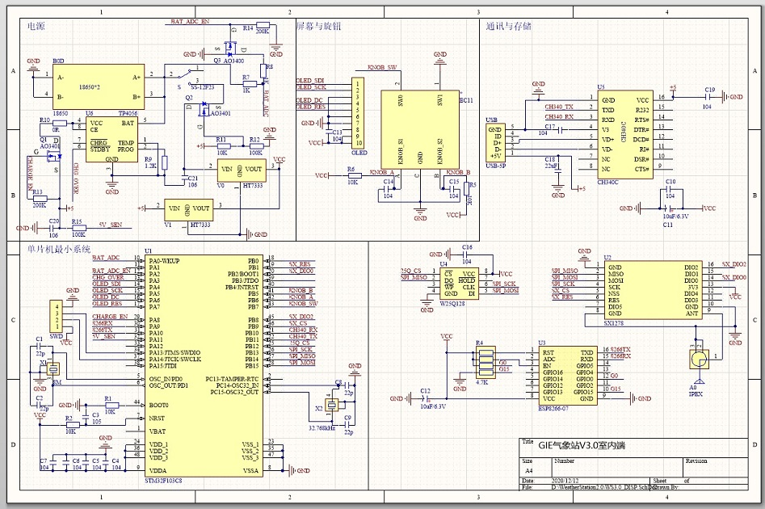

# Weather_Station_V3_OneNet_WiFi_LoRa
STM32+ESP8266+SX1278+Onenet的户外气象站制作
================
中文版制作教程请下拉。   
This repository contains all design files for an outdoor weather station. It can detect temperature, humidity, atmospheric pressure, TVOC, CO2, PM2.5, UV intensity and its own voltage. Then it can upload these parameters to the OneNet IoT platform through Wifi and http protocols. At the same time, it also provides the source code of an Android APP which can connect the OneNet platform and show these parameters.  
The design is divided into three parts:  
* Outdoor Data Collector
* Indoor Data Display&Uploader
* Android APP  
  
# Outdoor Data Collector  
This is the most important part of this design. Sensors and controllers are as follows:  
* STM32L051C8T6 as main controller.  
* SX1278 sends data to the indoor uploader.  
* Two LS Ultra Capacitor 2.8V 3000F in serial to storage the power.  
* Two 9V 3Watts Solar Panels in parallel to power up the whole system.  
* BME680 to get temperature, humidity and atmospheric pressure.  
* SGP30 to get CO2 and TVOC.  
* VEML6070 to get UV intensity.  
* ZPH02 to get PM2.5.  
* ESP8266 to upload the data directly (Optional)  
**Schematic of Data Collector**  
  
**STEP 1 Collect ALL Materials!**  
Use Altium Designer to open the PCB project and check if the circuit is suitable for you. If you don't want any changes, you can directly submit the .PcbDoc files to the factory. And then compare the schematic diagram and the BOM(bill of materials) exported by AltiumDesigner to purchase components. Except the components in the BOM, you also need these:  
LS Ultra Capacitor 2.8V 3000F with protection board x2  
Outdoor waterproof box made by ABS or other reliable materials 160x210x100mm x1  
Test Tube 30x100mm(For installing UV sensor) x1  
Desiccant(For filling the test tube)  
Resin waterproof agent  
Venetian box for weather station  
M4 screws and nuts  
M4 60+6mm Stainless steel column x25  
PG7 waterproof head  x3  
Fiberglass board 300 mm * 300 mm * 3 mm x1  
Waterproof resin  
Wires and other small things  
**STEP 2 Complete the Welding of the Circuit**  
  
There is no special process for outdoor data-collector welding. The specific parameter of each component can be obtained by look at the schematic diagram.We recommend welding the chips, resistors and capacitors at first, then welding higher components, and finally welding the plug-ins, which can make the welding process more convenient.After the welding is completed, power on to test whether it is working properly. Normally, there will be abnormal work caused by improper welding.  
**STEP 3 Assembly**  
First, make four holes on the side of the box.Three of them are used to install the PG7 waterproof head and one is used to install the antenna.Be sure the holes have the right diameter.  
  
Then install the protection board of the ultra capacitor and lead out the wire, and then put it into the box. Next fill up the gap between the capacitor and the box with anything you can find.     
    
Find a suitable base-plate and fix the box to it. I used a scrap wooden board as the base-plate. Then fill up the test tube using desiccant and put the wired-up UV sensor into it. Then put the PM2.5 sensor(ZPH02), BME680, SGP30 into the venetian box.  
   
Install the test tube and the venetian box on the base-plate. In order to facilitate the installation, some things can be used to pad. For example, I used the black box left by the previous generation weather station to pad the sensors.  
  
Then use stainless steel column to put up the fiberglass board to cover the venetian box. This is to prevent direct sunlight from interfering with the sensors in the venetian box. Finally, install the solar panel above the fiberglass board and fix it with stainless steel column. The output of the solar panel is directly paralleled to the two ends of the capacitor through a 1N5819 diode.    
  
**STEP 4 Program and Debug**  
Notice: Because STM32 works under 1.8V voltage in this design, you need to download the program use the full version of JLINK.  
The program is created on the MDK521 using CUBE MX. The data collector and the uploader are connected by sx1278 in 433MHz frequency band.In order to save power, when the collector completes a data acquisition of sensors, it will pack all the data and send it in 433MHz frequency band only once. So the uploader needs to listen all the time to avoid missing packets.The communication protocol between collector and uploader is shown in the chart below.  

|  Byte  | 0-3 | 4-7 | 8-11 | 12-15 | 16-16 | 17-20 | 21-22 | 23-24 | 25-26 | 27-30 |
| :----: | :----: | :----: | :----: | :----: | :----: | :----: | :----: | :----: | :----: | :----: |
| Content | Temperature | Humidity | Pressure | Gas resistance | VOC Level | PM2.5 | UV | CO2 | TVOC | Voltage |
| Type | Float | Float | Float | Float | u8 | u32 | u16 | u16 | u16 | Float |
  
# Indoor Data Display&Uploader
This part of this design can recieve data packages from the outdoor collector. And then upload these data to OneNet using http protocol. In addition, the data can be stored in  128Mbit memory and displayed on a 256x64 OLED screen in real time. After connecting to the computer through USB, the data can be exported through serial port. Controller and other components are as follows:  
* STM32F103CBT6 as main controller.  
* SX1278 receive data from the outdoor collector.  
* Two 18650 lithium batteries to storage the power.    
* ESP8266 to connect the OneNet platform.  
* 256x64 OLED screen to display the data.  
* CH340C to connect the computer.  
* 25Q128 flash to store the data.  
* 3D printing shell.  
**Schematic of Data Uploader**  
  
**STEP 1 Collect ALL Materials!**  
The steps to export BOM are the same as before. In addition to the materials in the BOM, the following items need to be prepared:  
18650 lithium battery x2  
256x64 OLED screen x1  
IPEX-SMA cable x2  
Knob handle for ec11 x1  
10pin 1mm 10cm reverse FPC cable  x1  
3D printing shell(design file also in this repository  
M3 screws and nuts  
Dupont lines  
**STEP 2 Complete the Welding of the Circuit**  
Same as the data-collector...  
  
**STEP 3 Program and Debug**  
Same as the data collector, the program is also created on the MDK521 use CUBE MX and we also recommend using JLINK to download and debug the program. If you do not want to add or remove any functions, you can directly download the program into the microcontroller.  
Wifi name, password and various information required to access the OneNet platform can be written through the USB serial port using AT command.Use a micro usb cable to connect the computer and the uploader. If you are using this kind of USB serial port for the first time, you may need to install the CH340 driver.Then open a serial port assistant and select the port number that the uploader is connected to. Then you can send AT commands through serial port assistant to write configuration information.All available AT commands are shown below(Note: All commands need to end with a newline (\r\n)):  
* AT+EXP  
This command is used to query and export the weather information stored in the uploader.  
Using AT+EXP?, you can query the storage address of the latest data. The address indicates the location where the weather information is stored in the flash, starting from 0x10000 (0x00000-0x10000 are reserved for storing configuration information). Each time a piece of weather information is stored, the address will increase by 64 bytes, which is Hexadecimal 0x40, for example, when the first message is stored, the latest address will change from 0x10000 to 0x10040, and so on.  
Using AT+EXP=<addr> you can export all weather information starting from this address to the latest. If addr=10000, all weather information can be exported.(Example: AT+EXP=10000)  
* AT+ERS  
This command can be used to erase all weather information. For safety, you need to type and send this command twice to complete the deletion.  
* AT+CWJAP  
This command can be used to configure the ssid and password of the Wifi connected to the uploader.  
Using AT+CWJAP=<WiFi SSID>,<WiFi password> to achieve it. For example:AT+CWJAP=TP-Link-xxx,88888888. Note that the SSID cannot be longer than 21 letters, and the password cannot be longer than 20 letters, otherwise the configuration will fail.  
* AT+CMSET  
This command can be used to set the access information of the OneNet platform.  
Using AT+CMSET=<dev_id>,<API-key> to achieve it. For example:AT+CMSET=657284563,SkFGTtTMpEFf=xG580jwowTZ9r0=.
  
**STEP 4 Assembly**  
Because it is not easy to modify the circuit or program after assembly, we recommend installing it into the shell after debugging.You can paint the shell to your desired color before assembling if you like. In addition, you can also use the DuPont cable to lead the debug port to the side of the circuit board, so that you can easily modify the program even after assembly.  
  
The first step in assembly is to install the screen. First, insert the FPC cable into the screen, and then fold the FPC into a 90-degree angle so that it can be drawn out from the side. Then put the screen into the shell diagonally upwards, so that the PCB of the screen is stuck in the gap at the top of the shell and allow the screen expose completely. Then use hot melt glue to simply fix the bottom and sides of the screen.  
Then insert the circuit board with the battery into the shell. After installing the back plate, the assembly is complete.
# Android APP
This APP can connect the OneNet and get the data. It is built on Android Studio. Please understand that it only has Chinese version currently.
  
#
STM32+ESP8266+SX1278+Onenet的户外气象站制作
=============
此仓库包含室外气象站的所有设计文件。可检测温度、湿度、大气压、TVOC、CO2、PM2.5、紫外线和自身电压。然后可以通过Wifi和http协议将这些参数上传到中国移动OneNet物联网平台。同时还提供了一个Android APP的源代码，可以从OneNet平台获取气象站的数据。  
设计分为三部分：
* 室外数据采集器  
* 室内数据显示上传器  
* Android应用程序  
  
# 户外采集端  
户外采集端是本设计的主体部分，传感器和控制器如下：
*主控制器STM32L051C8T6  
*SX1278发送数据到室内中继  
*两个串联的LSUC的超级电容2.8V 3000F  
*两块9伏3瓦的太阳能电池板并联为整个系统供电  
*BME680获得温度、湿度和大气压  
*SGP30获取CO2和TVOC  
*VEML6070获取紫外线强度  
*ZPH02获取PM2.5  
*ESP8266直接上传数据（可选）  
**户外采集端原理图**  
  
**步骤一 收集材料**  
使用Altium Designer打开PCB项目，检查电路是否合适。如果不想做任何更改，可以直接将.PcbDoc文件发到淘宝上做pcb的厂家。然后使用AltiumDesigner导出的元器件清单（BOM）采购元件。除此之外，还需要如下零部件：  
LSUC超级电容2.8V 3000F，以及保护板  x2  
户外防水盒160x210x100mm x1  
试管30x100mm（用于安装紫外线传感器）x1  
干燥剂（用于填充试管）  
树脂防水剂  
气象站用百叶盒子  
M4螺丝和螺母
M4 60+6mm不锈钢柱x25
PG7防水头x3  
玻璃纤维板 300x300x3 mm x1  
PCB保护树脂
电线和其他小零件  
**步骤二 电路焊接**  
  
焊接上没什么好说的，每个元件的具体型号可以通过查看原理图获得。建议先焊接芯片、电阻、电容，再焊接较高的元器件，最后焊接插件，这样可以使焊接过程更加方便。然后通电测试是否正常工作，一般情况下都会有焊接不当导致的异常。  
**步骤三 组装**  
首先，在防水盒的侧面打四个孔，其中的三个用于安装PG7防水头，一个用于安装天线，根据具体情况决定孔的正确直径。  
  
然后装上超级电容的保护板，引出导线，然后放入盒内，用你能找到的任何东西填满电容和盒子之间的空隙。   
    
找一个合适的底板，把盒子固定在上面。我用了一块废木板做的底板。然后将燥剂倒入试管，并将连接好的紫外线传感器放入试管中，然后将PM2.5传感器（ZPH02）、BME680、SGP30放入百叶盒。   
   
将试管和百叶盒安装在底板上。为了便于安装，有些东西可以用来垫，比如我这里用上一代气象站留下的黑盒子来把这俩垫起来。  
  
为了防止阳光直射干扰百叶盒中的传感器，需要用不锈钢柱搭玻璃纤维板盖住百叶盒。然后将太阳能板安装在玻璃纤维板上方，并用不锈钢柱固定，太阳能电池板的输出通过一个1N5819二极管直接并联到电容的两端。最后用放水树脂将所有可能漏水、腐蚀的地方涂好即可。  
  
**步骤四 程序下载与调试**  
注意：由于本设计中STM32工作在1.8V电压下，因此需要使用完整版的JLINK下载程序。
程序是使用CubeMX在MDK521上创建的。户外采集端和室内中继以433MHz频段sx1278通信，为了省电，当采集端完成传感器的数据采集后只会在433MHz频段发送一次，所以室内中继端需要一直监听以避免遗漏包。采集器和上传器之间的通信协议如下表所示。

|  字节  | 0-3 | 4-7 | 8-11 | 12-15 | 16 | 17-20 | 21-22 | 23-24 | 25-26 | 27-30 |
| :----: | :----: | :----: | :----: | :----: | :----: | :----: | :----: | :----: | :----: | :----: |
| 内容 | 温度 | 湿度 | 气压 | 烟阻 | VOC等级 | PM2.5 | 紫外线 | 二氧化碳 | TVOC | 电压 |
| 类型 | Float | Float | Float | Float | u8 | u32 | u16 | u16 | u16 | Float |  
# 室内数据中继与显示端
这部分设计可以接收来自室外采集端的数据包。然后使用http协议将这些数据上传到OneNet。此外，数据还将存储到128Mbit闪存中，并实时显示在256x64的oled屏幕上，通过USB连接到计算机后，可以通过串口导出数据。控制器及其它部件方案如下：  
* STM32F103CBT6为主控  
* SX1278从室外采集端接收数据  
* 两个18650锂电池供电  
* ESP8266连接OneNet平台  
* 256x64 OLED屏幕显示数据  
* CH340C连接电脑  
* 25Q128闪存存储数据  
* 3D打印外壳  
**室内数据中继端原理图**  
  
**步骤一 收集材料**  
导出BOM表的步骤与前面相同。除了BOM表中的材料外，还需要准备以下元件：  
18650 锂电池 x2  
256x64 OLED 屏幕 x1  
IPEX-SMA 转接线 x2  
ec11旋钮帽 x1  
10pin 1mm 10cm 反向 FPC线  x1  
3D 打印外壳（设计文件同样在仓库中）  
M3螺丝与螺母  
母对母杜邦线  
**步骤二 电路焊接**  
与数据采集端相同...  
  
**步骤三 程序下载与调试**  
与数据采集器相同，该程序也是在MDK521上创建的，使用cubemx，建议使用JLINK下载和调试该程序。如果不想添加或删除任何功能，可以直接将程序下载到微控制器中。    
Wifi名称、密码和访问OneNet平台所需的各种信息都可以通过USB串口AT命令修改，用micro USB线连接电脑，如果是第一次使用这种USB串口，可能需要安装CH340驱动，然后打开串口调试助手并选择连接到的端口号，然后就可以通过串口助手发送AT命令来修改配置了。全部可用的AT命令如下所示（注意：所有命令都需要以换行符（\r\n））结尾：  

* AT+EXP  
此命令用于查询和导出数据中继端中存储的天气信息。  
使用AT+EXP?，可以查询最新数据的存储地址，地址指示天气信息存储在闪存中的位置，从0x10000开始（0x00000-0x10000保留用于存储配置信息），每次存储一条天气信息时，地址都会增加64个字节，即十六进制的0x40，例如存储第一条信息时，最新地址会从0x10000变为0x10040，以此类推。  
使用AT+EXP=<addr>可以将从该地址开始的所有天气信息导出。如果addr=10000，则可以导出所有天气信息（例如：AT+EXP=10000）  
  
* AT+ERS  
此命令可用于删除所有天气信息。为了安全起见，需要并发送此命令两次以完成删除。  
  
* AT+CWJAP
此命令可用于配置连接Wifi的名称和密码。  
使用AT+CWJAP=<WiFi SSID>，<WiFi password>实现。示例：AT+CWJAP=TP-Link xxx,88888888. 注意wifi名称不能超过21个字母，密码不能超过20个字母，否则配置将失败。  
* AT+CMSET  
此命令可用于设置OneNet平台的访问信息。  
使用AT+CMSET=<dev\uid>，<API key>实现。示例：AT+CMSET=657284563,SkFGTtTMpEFf=xG580jwowTZ9r0=
**步骤四 组装**  
由于在组装后修改电路或程序不容易，我们建议在组装后将其安装到外壳中调试。组装前可以把外壳漆成你想要的颜色。此外，还可以使用杜邦线将调试端口引到电路板的一侧，这样即使在组装之后也可以方便地修改程序。   
  
组装的第一步是安装屏幕，首先将FPC插入屏幕，然后将FPC折叠成90度角，以便从侧面拉出，然后将屏幕对角向上放入外壳中，使屏幕的PCB卡在外壳顶部的缝隙中，使屏幕完全露出。然后用热熔胶简单地固定屏幕的底部和侧面，  
然后将带电池的电路板装入外壳，安装背板后即可完成组装。
# Android APP
这个应用程序可以连接OneNet并随时获取气象站数据，基于Android Studio建立，打包好的APK和源代码本仓库均有提供。
  